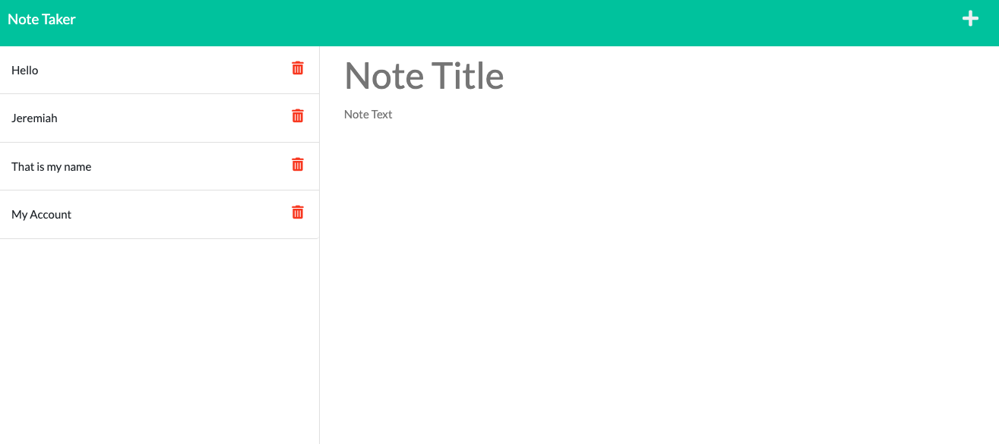

# The-Note-Taker
Challenge 11

## Description
My name is Jeremiah and I will be creating an application called the Note Taker. The application  can be used to save notes and used to write. My application will be used by Express.js backend and will retrieve note data from a JSON file.

## Visuals

Below is the screenshots of my note taker application.As you can see I saved some notes I needed to save for later.

## Authors and Acknowledgment
I would like to thank my instructors for the advice and extra tips to help me locate the problems that are needed to be solved to make an application function correctly.

 

README is maintained by Jeremiah Warren, followed by the [The-Note-Taker](https://github.com/Jwarren619/The-Note-Taker) and hosted on [GitHub](https://github.com/Jwarren619).

